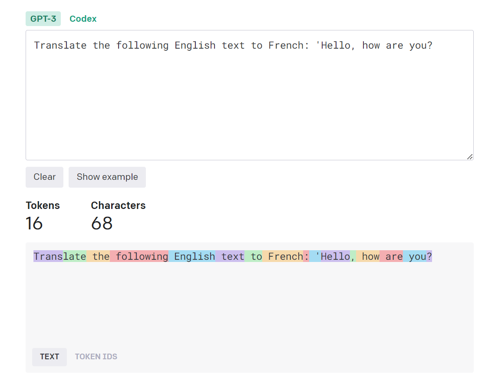
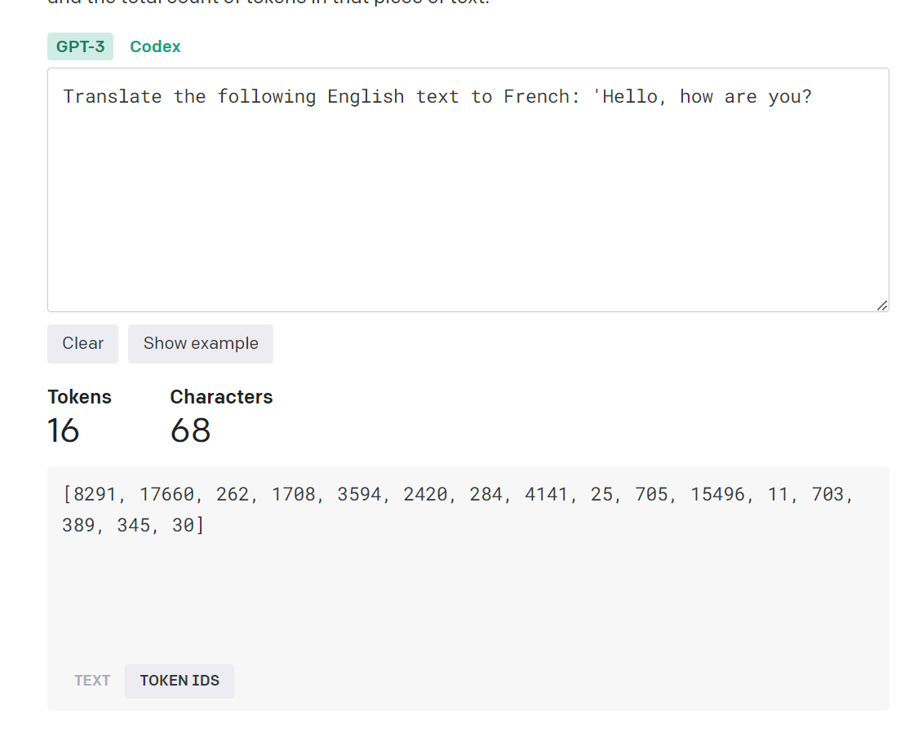

- [Tokens](#tokens)
  - [Token](#token)
  - [Tokenization](#tokenization)
    - [Details about Tokenizer Algorithms](#details-about-tokenizer-algorithms)
    - [Tokenization Example](#tokenization-example)
    - [Token Visualizer](#token-visualizer)
  - [Why is Tokenization needed?](#why-is-tokenization-needed)
    - [Maximum Token limit](#maximum-token-limit)
      - [Token Limits of Popular LLMs](#token-limits-of-popular-llms)

# Tokens

LLMs don't comprehend raw text as language. Instead words are encoded into numerical representations (tokens). These tokens are fed into the model for processing. 

LLMs work by breaking a query into smaller components and then using statistical models to predict the most likely response based on the patterns that it learned during training.

## Token

A token is a single word, character or subword unit, which are common sequences found in text. 

## Tokenization

This is the process of reducing the complexity of text, by converting it into individual words, subwords, or punctuation that the model can use for processing.  

Tokenization is performed using algorithms like **[Byte Pair Encoding (BPE)](https://en.wikipedia.org/wiki/Byte_pair_encoding)**, **[SentencePiece](https://towardsdatascience.com/sentencepiece-tokenizer-demystified-d0a3aac19b15)**, **[Unigram LM](https://medium.com/mti-technology/n-gram-language-model-b7c2fc322799)**, or **[WordPiece](https://huggingface.co/learn/nlp-course/chapter6/6?fw=pt)**. These algorightms split text into small units, and understands frequent and rare words, which helps limit the model’s vocabulary size but still enables the ability to represent any text sequence.

Once the words have been broken down into tokens, the tokens are converted into specific IDs that match the vocabulary model of the LLM.

### Details about Tokenizer Algorithms

Hugging Face has a great [overview](https://huggingface.co/docs/transformers/tokenizer_summary) explaining the differnce between the various algorithms, and how they work.

### Tokenization Example

Example of using the HuggingFace Transformers library and the GPT-3.5 model:

```python
from transformers import AutoTokenizer

# Load the tokenizer for the GPT-3.5 model
tokenizer = AutoTokenizer.from_pretrained("gpt-3.5-turbo")

# Define the prompt
prompt = "Translate the following English text to French: 'Hello, how are you?'"

# Tokenize the prompt
tokenized_prompt = tokenizer(prompt, return_tensors="pt")

# Print the tokenized input
print(tokenized_prompt)
```

This will break this sentence down into the following tokens.



Then the text snippets can be converted to TokenIDs that correspond to an ID in the model's vocabulary.

**input_ids** - represents the tokenized version of the prompt, where each number corresponds to a token ID in the model's vocabulary.

**attention_mask** indicates which tokens should be attended to (1) and which should be ignored (0). (none are ignored in this example)

Output:
```python
{
 'input_ids': tensor([[8291, 17660, 262, 1708, 3594, 2420, 284, 4141, 25, 705, 15496, 11, 703, 389, 345, 30]]),
 'attention_mask': tensor([[1, 1, 1, 1, 1, 1, 1, 1, 1, 1, 1, 1, 1, 1, 1, 1]])
}
```

These tokens are then converted to the following Vocabulary tokens corresponding to ChatGPT3.5.



### Token Visualizer

OpenAI has a useful [token visualizer](https://platform.openai.com/tokenizer) tool to help understand how sentences are broken down into tokens.

## Why is Tokenization needed?

Breaking text into tokens makes it more computationally efficient to handle and analyze, especially when dealing with large amounts of data.

### Maximum Token limit

LLMs have a limit to the amount of tokens allowed in each prompt. This is to restrict the number of tokens processed in a single interaction, which ensures efficient performance. 

Tokens might have different sizes depending on the vocabulary of the model. Certain characters of symbols might be treated as seperated tokens, and adding tokens representing beginning or ending of text can impact the count. Whitespace is not ignored, and will increase the count.

This is important when dealing with limited token budgets (when using LLMs that calculate usage based on token usage. When text needs to be truncated or shortened, important context might be lost.

#### Token Limits of Popular LLMs

| Language Model          | Token Limit |
| ----------------------- | ----------- |
| Bard                    | 8196        |
| ChatGPT (GPT-3.5-Turbo) | 4096        |
| ChatGPT (GPT-4)         | 8192        |
| ChatGPT (GPT-4-32k)     | 32,768      |
| Llama                   | 2048/4096   |
| StableLM-Alpha          | 4096        |
| T5                      | 512         |
| OpenLLaMA               | 2048        |
| MPT-7B                  | 84k         |
| Claude                  | 100k        |

